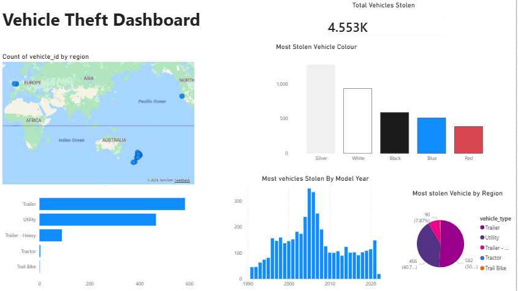

# Vehicle Theft Data Engineering Pipeline using Microsoft Fabric

## Project Overview

Built an end-to-end data engineering pipeline using Microsoft Fabric to process and analyze vehicle theft data using medallion architecture.

---

## Tech Stack

- Microsoft Fabric
- PySpark
- Lakehouse
- Data Pipeline
- Power BI
- Medallion Architecture

---

## Architecture

---

## Workflow

### Bronze Layer
Raw CSV ingestion into Fabric Lakehouse

### Silver Layer
Data cleaning and standardization using PySpark notebooks

### Gold Layer
Analytics-ready transformed tables

### Reporting Layer
Interactive Power BI dashboard for insights

---

## Transformations Performed

- Column name standardization
- Null checks
- Data cleaning
- Aggregations
- Analytical feature engineering

---

## Dashboard Insights

- Total Vehicles Stolen
- Theft Distribution by Region
- Most Stolen Vehicle Colour
- Theft Trend by Model Year
- Vehicle Type Distribution

---

## Dashboard Preview

---

## Key Learnings

- Fabric Lakehouse workflow
- PySpark distributed transformations
- Pipeline orchestration
- Gold layer semantic modeling
- Power BI reporting integration

